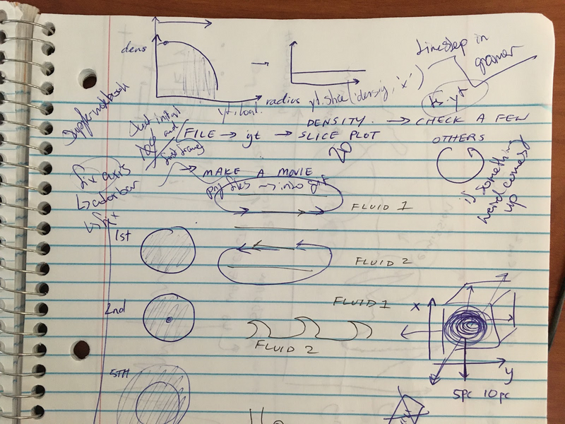
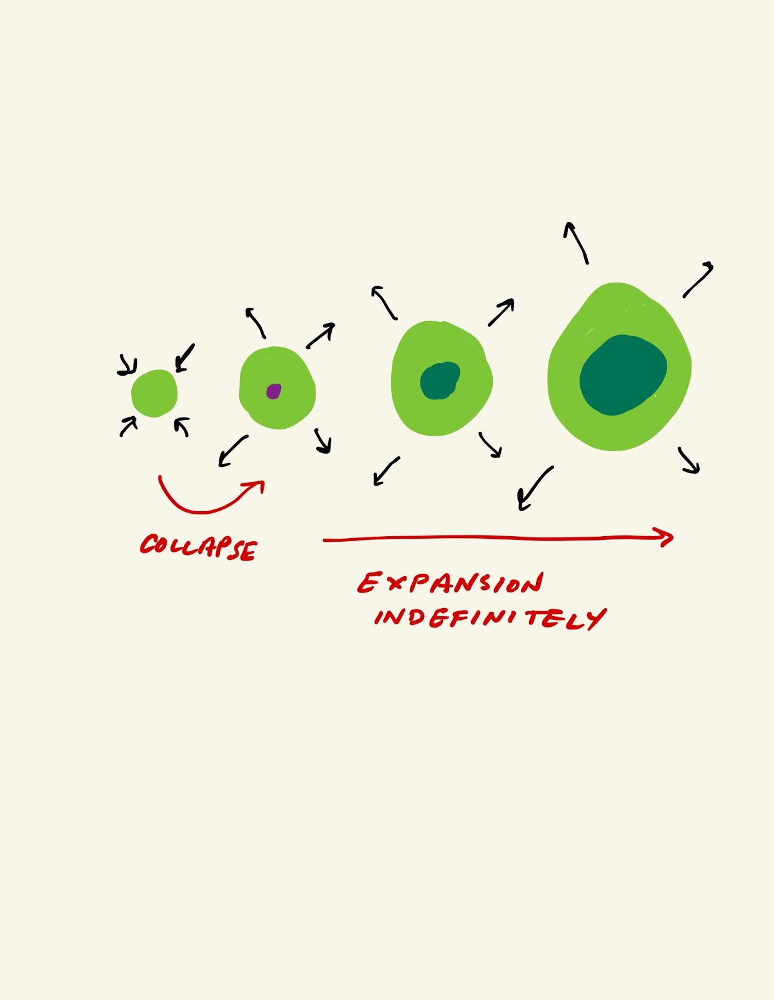
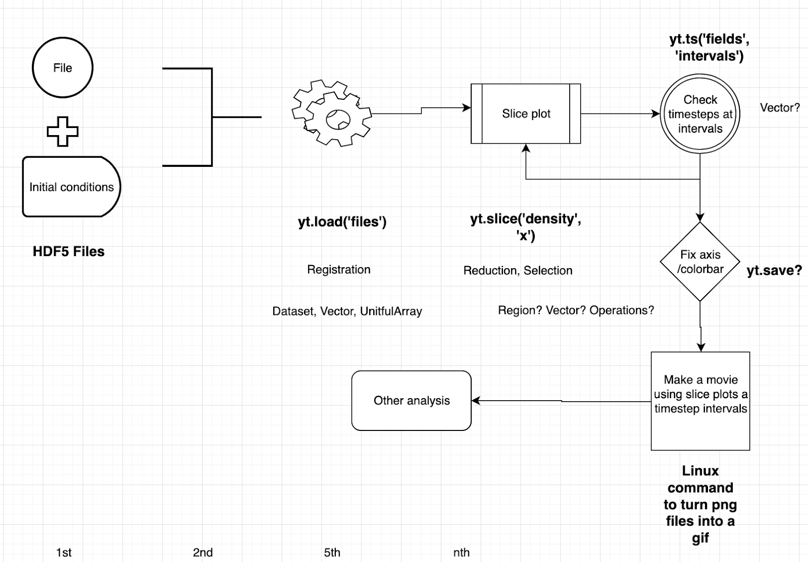
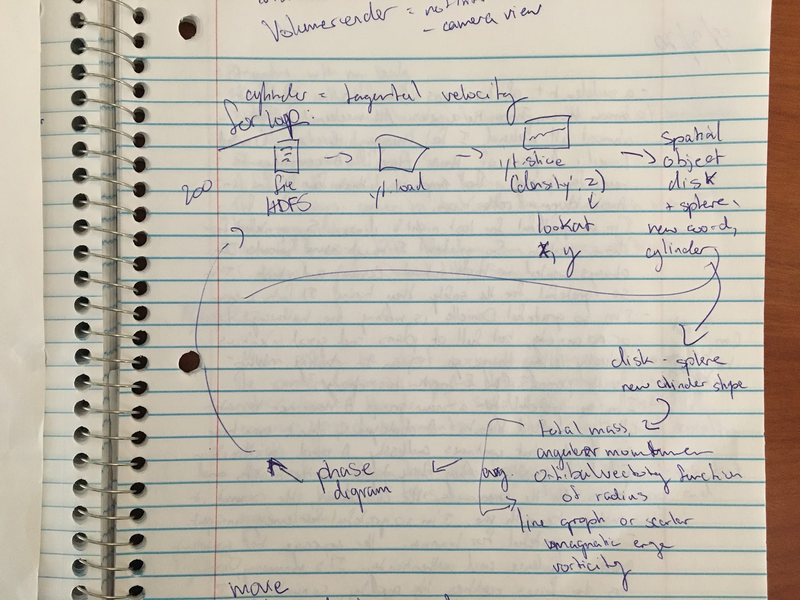
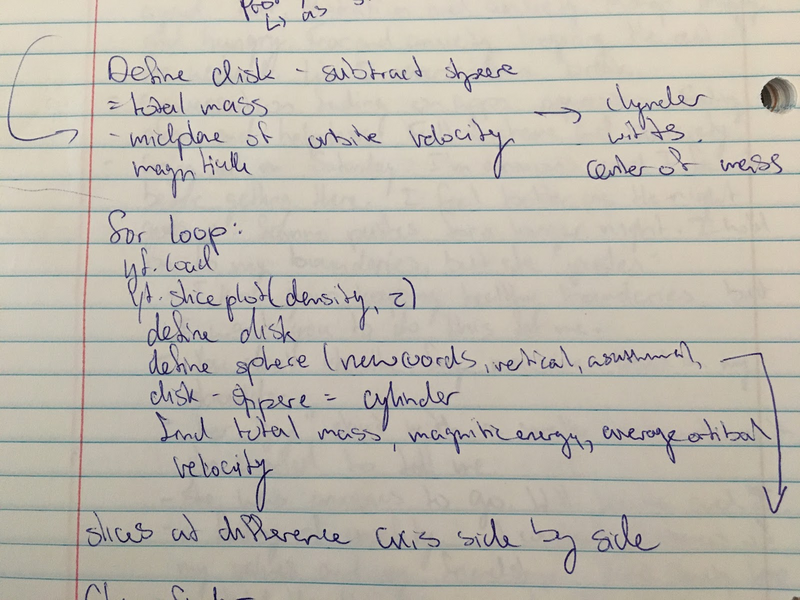
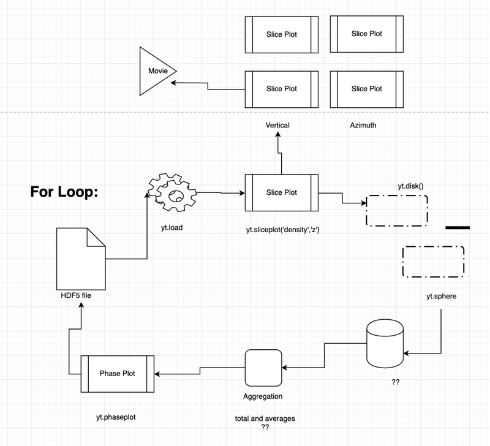
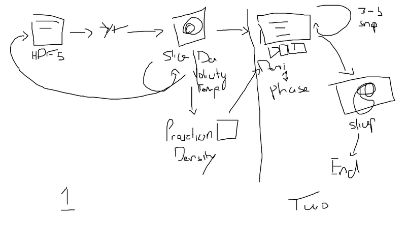
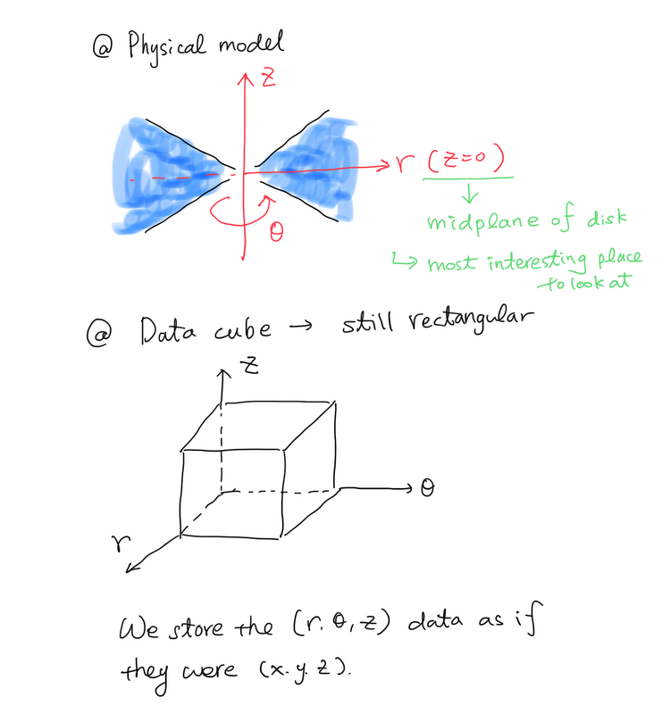
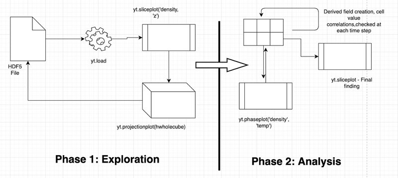
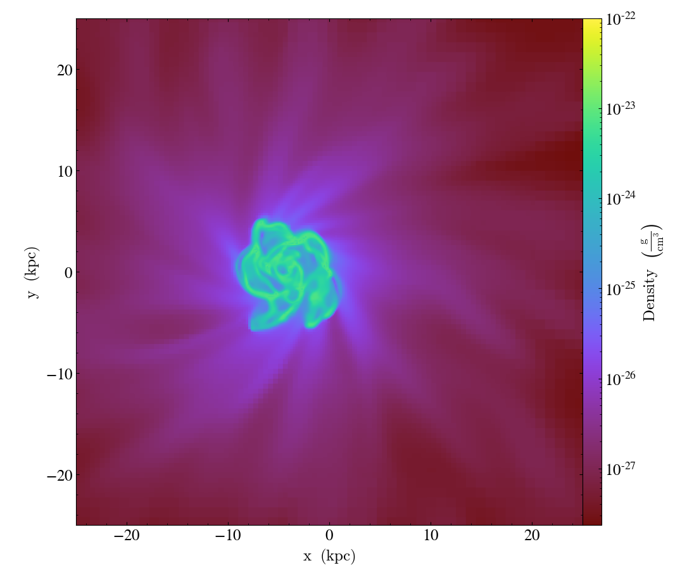

<!-- .slide: class="titleslide" -->

# A Grammar of Analysis for Volumetric Astrophysical Data

## Matthew Turk

<p data-markdown=true>School of Information Sciences<br/>
University of Illinois at Urbana-Champaign<br/>
<tt>mjturk@illinois.edu</tt><br/>
<tt>matthewturk.github.io</tt></p>

---

## Thank you

Before I begin, I want to say thank you for the organizers for putting this together and for inviting me to be a part of this.

I am humbled and grateful for this opportunity, especially in the midst of the situation throughout the world right now.

---

## Credits: Local

<div class="multiCol">
<div class="col" data-markdown=true>

 <!-- .element: class="headshot" -->

Samantha Walkow <!-- .element: class="headshot-caption" -->

</div>
<div class="col" data-markdown=true>

 <!-- .element: class="headshot" -->

Madicken Munk <!-- .element: class="headshot-caption" -->

</div>
<div class="col" data-markdown=true>

 <!-- .element: class="headshot" -->

Kacper Kowalik <!-- .element: class="headshot-caption" -->

</div>
</div>
<div class="multiCol">

<div class="col" data-markdown=true>

 <!-- .element: class="headshot" -->

Meagan Lang <!-- .element: class="headshot-caption" -->

</div>
<div class="col" data-markdown=true>

 <!-- .element: class="headshot" -->

Jared Coughlin <!-- .element: class="headshot-caption" -->

</div>
<div class="col" data-markdown=true>

 <!-- .element: class="headshot" -->

Chris Havlin <!-- .element: class="headshot-caption" -->

</div>
</div>

---

## Credits: `yt`

`yt` is a community of users and developers.  The steering committee is made up of:

 * Britton Smith
 * Madicken Munk
 * John ZuHone
 * Stephanie Tonnesen
 * Nathan Goldbaum
 * Matthew Turk
 * Cameron Hummels

Two additional folks who have bene extremely active lately I'd like to
recognize are Clément Robert and Corentin Cadiou.

---

<div style="width: 640px; padding-top:5em;" data-markdown=true>
<h1>We tell lies to visualize.</h1>

<h3 style="text-align:right;">&mdash; Stuart Levy</h3>
</div>

---

<div class="fig-container" data-file="figures/decoding.html" data-markdown=true>
</div>

---

<!--.slide: data-background-image="https://www.nasa.gov/sites/default/files/thumbnails/image/orion-nebula-xlarge_web.jpg" 
            data-background-size="cover" data-background-repeat="none" -->

---

<div class="fig-container" data-file="figures/orion_light.html" data-markdown=true>
</div>

---

<!-- .slide: data-background-image="images/clouds.jpg"
             data-background-size="cover" data-background-repeat="none" -->

---

<!-- .slide: data-background-image="https://upload.wikimedia.org/wikipedia/commons/b/bd/Kelvin_Helmholz_wave_clouds.jpg"
             data-background-size="cover" data-background-repeat="none" class="full" -->

<div class="multiCol">
<div class="col" data-markdown=true>
</div>
<div class="col fragment fade-in" style="opacity:0.7;background-color: white;" data-markdown=true>
$$\begin{aligned}{\partial \rho  \over \partial t}+\nabla \cdot (\rho \mathbf{v}) &= 0\\
{\frac {\partial \mathbf {v} }{\partial t}}+\mathbf {v} \cdot \nabla \mathbf {v} +{\frac {\nabla p}{\rho }}&=\mathbf {g}\\
{\partial e \over \partial t}+\mathbf {v} \cdot \nabla e+{\frac {p}{\rho }}\nabla \cdot \mathbf {v} &=0\end{aligned}$$
</div>
</div>

<!--<p class="mediumtext centered"><a href="https://commons.wikimedia.org/wiki/File:Kelvin_Helmholz_wave_clouds.jpg">Brocken Inaglory [CC BY-SA 4.0], via Wikimedia Commons</a></p> -->

---

<div class="multiCol">
<div class="col">
<div class="fig-container" data-style="height: 600px;" data-file="figures/kh_example.html" data-markdown=true>
</div>
</div>
<div class="col" data-markdown=true>
$$\begin{aligned}{\partial \rho  \over \partial t}+\nabla \cdot (\rho \mathbf{v}) &= 0\\
{\frac {\partial \mathbf {v} }{\partial t}}+\mathbf {v} \cdot \nabla \mathbf {v} +{\frac {\nabla p}{\rho }}&=\mathbf {g}\\
{\partial e \over \partial t}+\mathbf {v} \cdot \nabla e+{\frac {p}{\rho }}\nabla \cdot \mathbf {v} &=0\end{aligned}$$
</div>
</div>

---

## But, what do people do?

 <!-- .element: class="headshot" -->

Samantha Walkow has been conducting an investigation into "data storytelling" and how individual researchers describe their process.<!-- .element: class="headshot-caption" -->

---

<div class="multiCol">
<div class="col">

<!-- .element: class="storypanel fragment" -->

</div>
<div class="col">

<!-- .element: class="storypanel fragment" -->

</div>
</div>
<div class="multiCol">
<div class="col">

<!-- .element: class="storypanel fragment" -->

</div>
<div class="col">

<!-- .element: class="storypanel fragment" -->

</div>
</div>

---

<div class="multiCol">
<div class="col">

<!-- .element: class="storypanel fragment" -->

</div>
<div class="col">

<!-- .element: class="storypanel fragment" -->

</div>
</div>
<div class="multiCol">
<div class="col">

<!-- .element: class="storypanel fragment" -->

</div>
<div class="col">

&nbsp;

</div>
</div>

---

<div class="multiCol">
<div class="col">

<!-- .element: class="storypanel fragment" -->

</div>
<div class="col">

<!-- .element: class="storypanel fragment" -->

</div>
</div>
<div class="multiCol">
<div class="col">

<!-- .element: class="storypanel fragment" -->

</div>
<div class="col">

&nbsp;

</div>
</div>

---

# Vocabulary of Data Analysis

<div class="appearing_row" style="margin-top: 1em;">
  <div class="fragment" data-fragment-index=1>
  <div class="right_align">
    <span><i class="fas fa-align-right fa-5x"></i></span>
  </div>
  </div>
  <div class="fragment" data-fragment-index=1>
  <div class="left_align" style="font-size: 200%;">
    Registration
  </div>
  </div>
</div>

<br clear="all"/>

<div class="appearing_row" style="margin-top: 1em;">
  <div class="fragment" data-fragment-index=2>
  <div class="right_align">
    <span><i class="fas fa-calculator fa-5x"></i></span>
  </div>
  </div>
  <div class="fragment" data-fragment-index=2>
  <div class="left_align" style="font-size: 200%;">
    Transformation
  </div>
  </div>
</div>

<br clear="all"/>

<div class="appearing_row" style="margin-top: 1em;">
  <div class="fragment" data-fragment-index=3>
  <div class="right_align">
    <span><i class="fas fa-object-group fa-5x"></i></span>
  </div>
  </div>
  <div class="fragment" data-fragment-index=3>
  <div class="left_align" style="font-size: 200%;">
    Selection
  </div>
  </div>
</div>

<br clear="all"/>

<div class="appearing_row" style="margin-top: 1em;">
  <div class="fragment" data-fragment-index=4>
  <div class="right_align">
    <span><i class="fas fa-mortar-pestle fa-5x"></i></span>
  </div>
  <div class="fragment" data-fragment-index=4>
  <div class="left_align" style="font-size: 200%;">
    Reduction
  </div>
  </div>
</div>

<br clear="all"/>

---

<div class="multiCol">
<div class="col">

# Registration

<p class="fragment">Data is laid out on <b>disk</b> in some manner that may or may not correspond to the spatial organization or physical meaning of what it represents.</p>

<p class="fragment">This data can be laid out in a data structure in <b>memory</b> that represents its logical ordering, with axes and dimensions.</p>

<p class="fragment">Finally, we can register one or multiple datasets in a consistent <b>spatial</b> representation so that we can query fields at specific locations and define $f(\mathbf{x})$.</p>

</div>

<div class="col">
<div class="fig-container" data-file="figures/volume_layout.html" data-preload data-style="height: 600px;">
</div>
</div>
</div>

---

<div class="multiCol">
<div class="col">

# Registration

<p class="fragment">Given a functional form, discretely sampled data can also be registered for analysis, regardless of its layout on disk.</p>

<div class="fragment" data-markdown=true>
<p>This data may carry with it attributes regarding the density of samples, its neighbors, and fundamental quantities, which can be input into a sampling function over a location.</p>

`$$ A(\mathbf{r}) = \int A(\mathbf{r}')W(|\mathbf{r} - \mathbf{r}'|, h)\mathrm{d} V(\mathbf{r}') $$`
</div>

</div>

<div class="col">
<div class="fig-container" data-file="figures/particle_layout.html" data-preload data-style="height: 600px;">
</div>
</div>
</div>


---

<div class="multiCol">
<div class="col">
<div class="fig-container" data-file="figures/galaxy_transformations.html" data-preload data-style="height: 768px;">
</div>
</div>
<div class="col" data-markdown=true>

# Transformations

<p class="fragment">"Primitive" variables: $\rho, \mathbf{v}, e, ...$ can be combined in many different ways to produce fields that exist <i>in potentia</i>.</p>
<p class="fragment">Registration enables combinations at fixed spatial locations.</p>
<p class="fragment">For example, we can apply the arithmetic manipulation:
$$|v| = \sqrt{v_x^2 + v_y^2}$$
</p>
</div>
</div>

---

<div class="multiCol">
<div class="col" data-markdown=true>

# Selection

<p>Points can be filtered based on their connectivity, spatial organization, or criteria from one or more field values.</p>
</div>
<div class="col">
<div class="fig-container" data-file="figures/kh_operations.html" data-preload data-style="height: 768px;">
</div>
</div>
</div>

---

# Reductions

We can apply reductions along axes, paths and non-trivial manifolds.

<div class="fig-container" data-file="figures/kh_path.html" data-preload data-style="height: 600px;">
</div>

---

# Composability

<div class="fig-container" data-file="figures/cosmology.html" data-preload data-style="width: 900px;">

---

# Volumetric Analysis Platform

<div class="multiCol">
<div class="col">

</div>
<div class="col">

The `yt` platform for analysis is a mechanism for abstracting the underlying
operations and building reproducible analysis procedures, independent of data
representation and distribution.  `yt` supports a couple dozen data formats,
from the very big to the very small.

[yt-project.org](https://yt-project.org/)

<p class="fragment">
The implementation of a physically-aware grammar of analysis of this data will
foster better connections between machine learning models and data from the
natural sciences.
</p>

</div>
</div>

---

# Data Storytelling

We have to span the entire process from data **acquisition**, to **analysis**,
to **application** to develop understandable information for researchers.

We are implementing this grammar of analysis within `yt`, starting with high-level operations like visualizations.  We build this on the concepts developed by precursors such as `vega-lite` (Satyanarayan et al), volume visualization (Shih et al) and the Grammar of Graphics (Wilkinson), to encompass the full pipeline of registration, transformation, selection and reduction as applied to volumetric data.

<div class="multiCol">
<div class="col">

```json
{
    "fields": ["density", "temperature"],
    "axes": ["z"],
    "center": {
        "max": "density"
    },
    "widths": [ [50.0, "kpc"] ],
    "min": {
        "density": {
            "minimum": "density"
        }
    },
    "max": {
        "density": [1e-22, "g/cm**3"]
    }
}
```

</div>
<div class="col">

 <!-- .element: style="max-height: 300px;" -->

</div>

---

<!-- .slide: class="titleslide" -->

# Thank you!

And thanks to funding from the University of Illinois, the Gordon and Betty Moore Foundation, the National Science Foundation, NumFOCUS, and the Foundation for Food and Agriculture Research.
